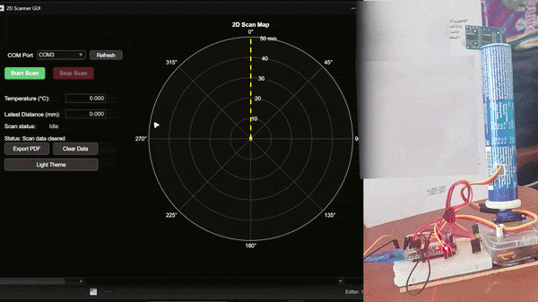
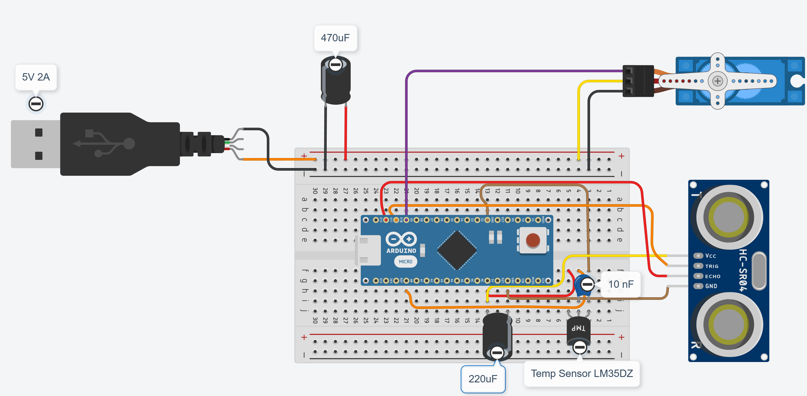

<p align="center">
  
</p>

<h1 align="center">Arduino MATLAB Ultrasonic Radar</h1>

<p align="center">
  <strong>360° ultrasonic scanning with a live MATLAB radar view. All for about $10.</strong>
</p>

<p align="center">
  <a href="LICENSE"></a>
  <a href="#"></a>
  <a href="#"></a>
  <a href="#"></a>
  <a href="#"></a>
</p>

---

## Features

| Real-Time | Interaction | Reliability |
|-----------|-------------|------------|
| Live polar heatmap - blue dots with white edges | **Ctrl+Scroll zoom** - 1.3× in/out when scan completes | **READY handshake** - serial sync with 5s timeout |
| **Auto-scaling** - `Rlim = max(DistMax × 1.3, 50)`, updates every 10 points | **Data tips** - hover any point → see `θ (°)` and `R (mm)` | **Data validation** - angle 0–360°, distance 0–10,000mm |
| **Sweep animation** - yellow dashed line at 60fps | **Export vector PDF** - publication-ready via `exportgraphics` | **Auto-reconnect** - 5 retries on port loss |
| **Return sweep** - magenta dashed line during homing | **Dark/Light theme** - navy dark or cream light | **Clean shutdown** - timers stopped, `try/catch` serial delete |
| **Live temperature** - LM35, 3 decimal places | **Re-scan** - keeps serial open between runs | **Null-safe callbacks** - `isvalid` check on every tick |
| **Live distance** - HC-SR04, 3 decimal places | **Nice-step radial labels** - 1, 2, 2.5, 5, 10 algorithm | **Ctrl tracking** - key press/release doesn't conflict with data cursor mode |
| **Status indicator** - Idle (grey) / Scanning (green) / Complete (blue) / Stopped (orange) | **Grid labels on top** - `uistack` keeps text above data | **SCAN_COMPLETE handler** → auto-switches to return sweep animation |
| **Real-time data table** - stores angle, distance, temperature, timestamp | | **DONE handler** → stops timers, re-enables buttons |


| Firmware | Calibration Tool |
|----------|-----------------|
| **Non-blocking state machine** - IDLE → SCANNING → RETURNING | **Interactive pulse tuning** - `+`/`-` 1µs, `++`/`--` 10µs, direct number |
| **Async echo timing** - with timeout, no `delay()` | **Rotation time measurement** → auto-computes `SCAN_DURATION_MS` |
| **Temperature-compensated speed of sound** | **Outputs ready-to-copy** `#define` values for `scanner.ino` |
| **VCC bandgap measurement** - auto-calibrates LM35 to real supply voltage | |
| **EMA filter on temperature** - α = 0.15 | |
| **ADC noise reduction** - DIDR0, 10nF cap, 8-sample averaging | |
| **360° scan in 2510ms** - ~143°/s | |
| **250000 baud serial** | |

---

## Quick Start

```bash
git clone https://github.com/Salim-Ammar/arduino-matlab-ultrasonic-radar

# 1. Upload firmware to Arduino Nano
#    Open firmware/scanner/scanner.ino in Arduino IDE → Upload

# 2. Open the MATLAB app
#    Open matlab/ScannerApp.m in MATLAB → Run

# 3. Start scanning
#    Select COM port → Click "Start Scan"
```

Wire it up (see the pin table below), upload the code, and you're scanning. Download the project as a [ZIP file](https://github.com/Salim-Ammar/arduino-matlab-ultrasonic-radar/archive/refs/heads/main.zip).

---

## Pin Connections

| Component | Arduino Nano Pin | Notes |
|-----------|:----------------:|-------|
| HC-SR04 **TRIG** | D10 | Send 10µs pulse to start ranging |
| HC-SR04 **ECHO** | D11 | Read pulse width - proportional to distance |
| LM35DZ **OUT** (optional) | A0 | Analog voltage - 10mV per °C, not required for basic operation |
| SG90 **PWM** | D9 | 50Hz signal - sweep / stop / return |
| SG90 **VCC** | External 5V charger | Independent supply - servo draws peaks |
| **Common GND** | GND | Shared ground across all components |
| Servo decoupling | 470µF across VCC/GND | Reduces voltage drop on startup |
| LM35 decoupling (optional) | 10nF between OUT and GND | Only if LM35 is used |

> **Servo note:** The project uses an SG90 (modified for continuous rotation). A modified SG90 works but is not reliable for long. I highly recommend using an **FS90R** instead. It's built for continuous rotation out of the box, more consistent, and saves you the hassle of modifying a standard servo. I do not recommend the SG90 for this project.



---

## Complete Feature Reference

### MATLAB GUI (`ScannerApp.m` - 806 lines)

| Feature | Detail |
|---------|--------|
| COM port selection | Dropdown with auto-detect |
| Refresh ports | Manual + 5× auto-retry on connection loss |
| Start Scan | Sends `START` → waits for `READY` handshake |
| Stop Scan | Sends `STOP` → clean disconnect |
| Live temperature | 3-decimal read from LM35 |
| Live distance | 3-decimal read from HC-SR04 |
| Status indicator | Idle (grey) / Scanning (green) / Complete (blue) / Stopped (orange) |
| Status bar | Detailed text log of every state |
| Real-time polar plot | Blue dots with white edges, updates every 10 points |
| Auto-scaling | `Rlim = max(DistMax × 1.3, 50)`, adjusts radial grid live |
| Nice-step radial labels | Algorithm picks clean step values (1, 2, 2.5, 5, 10) |
| Sweep animation line | Yellow dashed, 60fps via 16ms timer |
| Return sweep line | Magenta dashed during return-to-home |
| Grid labels on top | `uistack` prevents data hiding labels |
| Data tips | Toolbar → hover → see `θ (°)` and `R (mm)` |
| Ctrl+Scroll zoom | 1.3× zoom in/out, only when scan is Complete |
| Export vector PDF | `exportgraphics` - ready to export |
| Clear data | Resets plot, data table, auto-scale |
| Theme toggle | Dark navy or cream light, full color scheme swap |
| Re-scan | Keeps serial port open between scans |
| Serial handshake | Waits for `READY` with 5s timeout |
| Data validation | Range check: angle 0–360°, distance 0–10,000mm |
| SCAN_COMPLETE handler | Auto-switches to return sweep |
| DONE handler | Stops timers, re-enables buttons, resets state |
| Clean shutdown | Stop timers → `drawnow` → `try/catch` delete serial |
| Null-safe callbacks | `isvalid(app)` on every timer tick |
| CtrlDown tracking | Key press/release doesn't interfere with data cursor mode |

### Firmware (`scanner.ino` - 303 lines)

| Feature | Detail |
|---------|--------|
| Non-blocking state machine | IDLE → SCANNING → RETURNING, no `delay()` |
| Async echo timing | Microsecond-resolution with timeout |
| Temperature-compensated SoS | `331.3 + 0.606 × T` |
| VCC bandgap calibration | Measures real supply voltage for accurate LM35 readings |
| EMA temperature filter | α = 0.15, smooths noisy readings |
| ADC noise reduction | DIDR0, 8-sample averaging |
| 360° scan in 2510ms | ~143°/s continuous rotation |
| Serial at 250000 baud | 10+ measurements per timer tick |

---

## Performance Benchmarks

| Metric | Value |
|--------|-------|
| Scan range | 360° continuous sweep |
| Scan time | 2510 ms |
| Angular resolution | ~1° |
| Max range | 4 m (HC-SR04 spec) |
| Usable range | 2 cm – 4 m |
| Accuracy | ±3 mm (after temperature compensation) |
| Temperature compensation | 331.3 + 0.606 × T °C |
| Temperature sensor | LM35, ±0.5°C accuracy |
| Measurement rate | ~125 Hz (8ms interval) |
| Baud rate | 250000 |

---

## Applications

- **Indoor obstacle detection** - map rooms, find furniture
- **Small-scale SLAM prototyping** - feed scans into MATLAB for occupancy grids
- **Educational platform** - learn embedded state machines, sensor fusion, real-time plotting
- **Sensor fusion research** - combine with IMU, magnetometer for enhanced mapping

---

## Repository Structure

```
arduino-matlab-ultrasonic-radar/
├── firmware/
│   ├── scanner/
│   │   └── scanner.ino          # Main firmware - 303 lines
│   └── calibrate_speed/
│       └── calibrate_speed.ino  # Servo calibration tool
├── matlab/
│   └── ScannerApp.m             # GUI app - 806 lines, all features
├── assets/
│   ├── hero.gif                 # Animated demo
│   └── wiring-diagram.png       # Full schematic
├── docs/
│   ├── calibration-guide.md     # Full servo calibration walkthrough
│   └── matlab-gui-guide.md      # Complete GUI reference
├── LICENSE                      # MIT
└── README.md
```

---

## Docs

- [Servo Calibration Guide](docs/calibration-guide.md) - tune your servo for perfect 360° rotation
- [MATLAB GUI Guide](docs/matlab-gui-guide.md) - all buttons, features, shortcuts explained

---

---

## License

MIT - see [LICENSE](LICENSE). Use it however you want. If something breaks, you get to keep both pieces.
