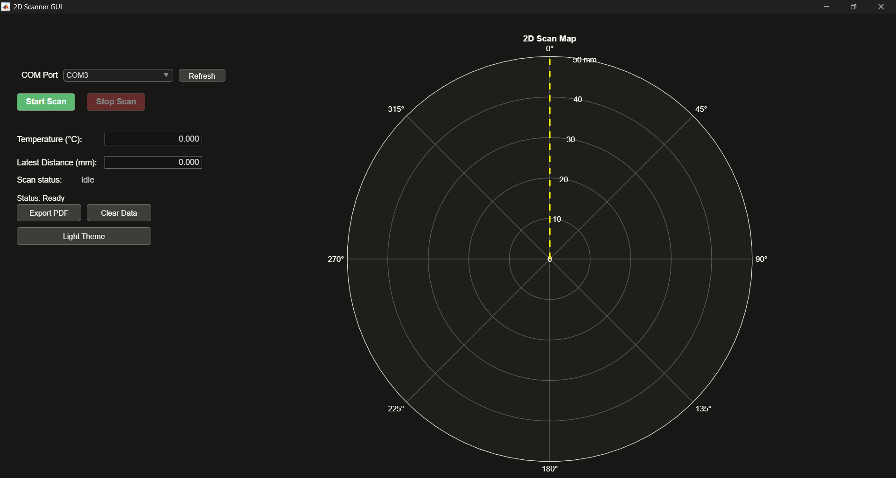

# MATLAB GUI Reference

## Overview

`ScannerApp.m` is a 806-line MATLAB class that provides real-time visualization and control for the 2D LiDAR scanner. Built with MATLAB App Designer.

## Interface Layout



## Controls Reference

### Connection

| Control | Action |
|---------|--------|
| COM Port dropdown | Select the Arduino's serial port |
| Refresh | Rescan available COM ports (auto-retries 5× on connection loss) |

### Scanning

| Button | What it does |
|--------|-------------|
| **Start Scan** | Connects to Arduino, waits for `READY` handshake (5s timeout), sends `START`, begins data acquisition |
| **Stop Scan** | Sends `STOP` command, disconnects serial, resets to idle |

### Visualization

| Feature | How it works |
|---------|-------------|
| **Polar heatmap** | Blue dots (`MarkerFaceColor [0 0.7 1]`) with white edges, no line connecting. Only measurement points |
| **Auto-scaling** | Radial axis = `max(highest distance × 1.3, 50)`. Updates every 10 readings |
| **Radial labels** | Algorithm picks clean step values (1, 2, 2.5, 5, 10). No ugly 7mm or 13mm ticks |
| **Sweep line** | Yellow dashed line **(60fps)** tracking current scan angle |
| **Return sweep** | Magenta dashed line visible during return-to-home |
| **Grid labels** | Always rendered on top of data points via `uistack` |

### Interaction

| Input | Effect | Constraint |
|-------|--------|------------|
| **Ctrl + Scroll up** | Zoom in 1.3× | Only when status = **Complete** |
| **Ctrl + Scroll down** | Zoom out 1.3× | Only when status = **Complete** |
| **Data cursor button** (toolbar) | Click to enable → hover any point → see `θ (°)` and `R (mm)` | Works on any scan |
| **Ctrl key tracking** | Press/release tracked globally; doesn't interfere with data cursor mode | Automatic |

### Data Management

| Button | Action |
|--------|--------|
| **Export PDF** | Saves polar plot as vector PDF via `exportgraphics`. Publication quality, infinitely zoomable |
| **Clear Data** | Resets data table, clears plot, resets auto-scale to 50mm |

### Theme

| Button | Does |
|--------|------|
| **Light Theme / Dark Theme** | Toggles full color scheme: background, text, axes, buttons, sweep line colors |

**Dark theme:** Navy background (`#181715`), white text, yellow sweep, magenta return  
**Light theme:** Cream background (`#faf9f5`), dark text, amber sweep, pink return

## Performance Details

- **Serial reads:** Up to 10 lines per timer tick (50ms timer, `BusyMode: 'drop'`)
- **Sweep animation:** Separate 16ms timer (60fps), independent of serial reads
- **Data storage:** Table with columns: `Angle`, `Distance`, `Temperature`, `Timestamp`
- **Clean shutdown:** Stops both timers → `drawnow nocallbacks` → `try/catch delete(serial)`

## Hardware Requirements

- **MATLAB R2019b+** (App Designer framework)
- Toolboxes: no external toolboxes required (`exportgraphics` requires R2020a+)
- Arduino Nano with `scanner.ino` firmware
- USB serial connection at 250000 baud

## Communication Protocol

```
MATLAB                    Arduino
  │                         │
  │─── START ──────────────>│
  │                         ├─── SCANNING state
  │<── angle,dist,temp ─────│  (repeated ~125 Hz)
  │                         │
  │<── SCAN_COMPLETE ───────│  (360° reached)
  │                         ├─── RETURNING state
  │<── DONE ────────────────│  (returned to 0°)
  │                         └─── IDLE state
  │
  │─── STOP ───────────────>│─── IDLE state immediately
```

## Common Issues

| Symptom | Cause | Fix |
|---------|-------|-----|
| GUI says "Waiting for READY" forever | Wrong COM port or Nano not running scanner.ino | Verify port, reset Nano, click Start again |
| No data points appear | Serial baud mismatch | Both sides must use **250000** baud |
| Plot is tiny (zoomed out) | Auto-scale needs data points | Scan completes at least 10 points |
| PDF export hangs | `exportgraphics` requires R2020a | Update MATLAB or use `print` instead |
| Sweep line doesn't move | Timer already running | Stop scan, clear data, start again |
